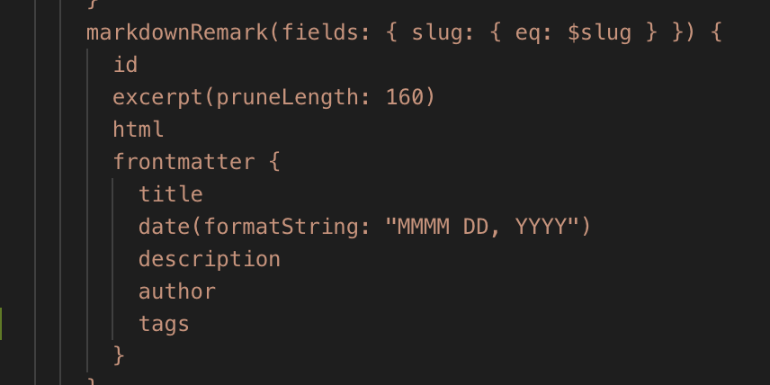

Today I'll be adding tags to the metadata of our blog posts. The blog is in its infancy, and it's important to think about archicture for scalability. With tags, authors can categorize their posts, which will allow for searching and filtering down the road! 

Today we'll simply be adding the tags attribute to the posts and confirm that our GraphQL query pulls them as expected. 

I'm following the instructions provided by the wonderful [Gatsby docs](https://www.gatsbyjs.org/docs/). 

## Adding the tags to the blog post markdown files

In the metadata section at the top of the .md file that already includes title, date, description and author, add tag, and its corresponding values. Since a post can have more than one tag, we'll assign it a list, rather than just a string. 

Before

After

Simple as that. 

## Add the tag attribute to your GraphQL query
So now that your blog post has a tag, we need to tell the GraphQL query in the templates/blog-post.js to ask for the tag attribute in its query. The post content is then stored in this.props.data.markdownRemarks. The metadat attributes live in ...markdownRemarks.frontmatter, with each attribute receiving its own node. 

To update the GraphQL query, in temploates/blog-posts.js, scroll down to the GraphQL query named pageQuery. Following the hierarchy noted above, and under author, add tags. 

Before

After

And legitimately - that's in. Your tags attribute will now live up in props, just like a prop standarly passed in React. 

## Testing that it worked
Did it work? Let's see. Let's go to our blog-post.js template at add the tag to confirm it's added to props as expected. For funzies, I added a Tags section below the rest of the post metadata on the in blog-post.js, using a map statement to loop through all the tags. 

In the markdown file we have 'aboutTheBlog' and 'thisJustGotMeta' - and that's what we see on our post! 

I've removed this code from the final post, but the tags now exist for further building!

